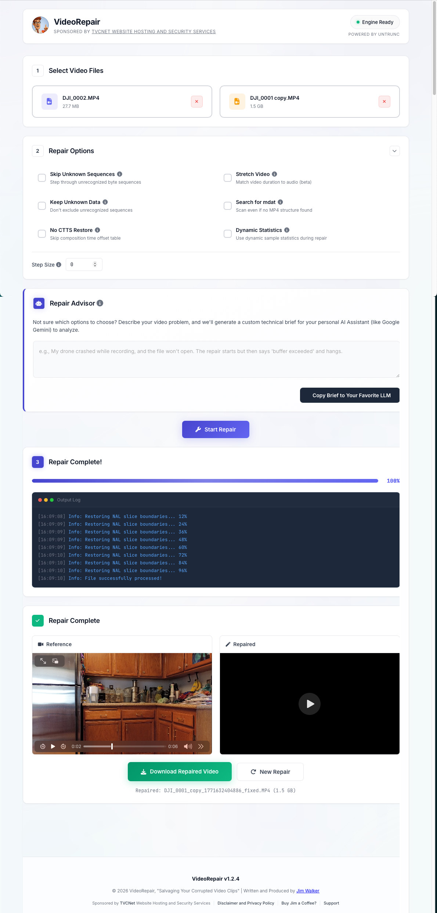

# VideoRepair Pro (Powered by Untrunc)

A secure, locally-hosted video repair tool. VideoRepair Pro provides a modern, responsive web GUI for the Untrunc C++ engine, allowing you to easily recover damaged MP4/MOV/M4V/3GP files without uploading sensitive media to the cloud. Features an AI Repair Advisor.



## Download the Mac App (Recommended)

If you are a macOS user and just want the clickable app:

- Go to the **GitHub Releases** page: [Latest Release](https://github.com/tvcnet/videorepair/releases/latest)
- Download the macOS installer assets (`.dmg` or `.zip`) from the release

Important:
- **GitHub `Code` -> `Download ZIP` is source code only**, not the installable Mac application.
- The packaged Mac app is distributed only through the **Releases** page assets.

Current packaged builds:
- Apple Silicon (`arm64`) macOS `.dmg` / `.zip` are published in the latest release.
- If macOS warns that the app is from an unidentified developer, use **Right-click -> Open** the first time.

## You need:
- Another video file (taken from the same camera/app) which isn't broken
- Node.js (v18+) and npm installed
- Basic ability to run a development server

## Key Features
- **Modern Web Dashboard**: An intuitive, responsive interface built with vanilla CSS (HackGuard Cyber-Day Indigo theme) and clean typography.
- **Local & Secure Execution**: All repair logic runs locally over the Untrunc engine in temporary isolated buffers. No clouds, no data retention.
- **AI Repair Advisor**: Automatically generates technical briefs describing your specific file corruption to easily paste into systems like Google Gemini or ChatGPT to get expert advice.
- **AI SEO Ready**: Optimized for modern search engine crawlers with Open Graph tags, Twitter Cards, and `application/ld+json` Schema definitions.

## Installing

This project can be loaded and run locally (e.g., using the Antigravity AI agent environment).

1. Load the project directory into your environment.
2. Install the necessary Node.js dependencies:
```bash
npm install
```
3. **Compile the `untrunc` C++ Engine Video Processing Binary**

**Step A. Install Dependencies**
You will need `ffmpeg` libraries and a C++ compiler. 

VideoRepair Pro utilizes a high-performance C++ backend engine called `untrunc` that must be compiled on your specific machine for optimal performance.

**Step A. Install Dependencies**
You will need `ffmpeg` libraries and a C++ compiler. 

*On macOS (using Homebrew):*
```bash
brew install ffmpeg yasm
```

*On Linux (Ubuntu/Debian):*
```bash
sudo apt-get update
sudo apt-get install build-essential libavformat-dev libavcodec-dev libavutil-dev yasm
```

**Step B. Compile the Engine**
Navigate into the engine's source directory and run `make`. 
*(Note: macOS requires specific path flags for Homebrew.)*

*On macOS:*
```bash
cd untrunc-master
export PKG_CONFIG_PATH="/opt/homebrew/lib/pkgconfig"
CPPFLAGS="-I/opt/homebrew/include" LDFLAGS="-L/opt/homebrew/lib" make
cd ..
```

*On Linux:*
```bash
cd untrunc-master
make
cd ..
```

Once completed, you should see an executable file simply named `untrunc` sitting inside the `untrunc-master` folder. The Node.js application is pre-configured to look for it there.

*(For more advanced compilation architectures like Docker, Windows `.exe` releases, or building with specific older FFmpeg versions, check out the engine's dedicated documentation in `untrunc-master/README.md`.)*

## Using

You need both the broken video and an example working video (ideally from the same camera with the same settings, if not the chances to fix it are slim).

Start the local server:
```bash
npm start
```
Then navigate to `http://localhost:3000` in your web browser.

1. **Select Reference Video**: Upload a working video shot on the exact same device.
2. **Select Damaged Video**: Upload your corrupted/truncated video file.
3. **Configure Options**: Optionally check "Skip Unknown Sequences", "Stretch Video", or let the AI Repair Advisor guide you.
4. **Start Repair**: Click start, and the repaired file will be generated and downloaded automatically.

That's it, you're done!

**💡 Pro Tip:** The fastest way to get started is to simply ask your built-in **Antigravity AI Agent** to install the dependencies, compile the local engine, and launch the application in your browser automatically.

> **Copy & Paste this prompt to your AI Agent:**
> "Please help me set up the VideoRepair Pro application in this workspace. Review `README.md` for compilation instructions specific to my OS. Install the necessary Node.js dependencies in the root directory, compile the `untrunc` C++ engine located in `untrunc-master`, start the local development server, and then verify the application loads correctly at `localhost:3000` in the browser."

## Help/Support

If you managed to recover your video smoothly, help us find time to keep working on this software and make other people happy. If you didn't, we are always trying to improve the underlying engine and app logic for new devices.

Support ongoing development and keeping these security and utility tools free:
[Buy Jim a Coffee](https://hackrepair.com/donations/buy-jim-a-coffee)

### Acknowledgments
Special thanks to the creator of the original tool codebase, Federico Ponchio, and to the maintainer of the high-performance fork used in this project, `anthwlock/untrunc`.
